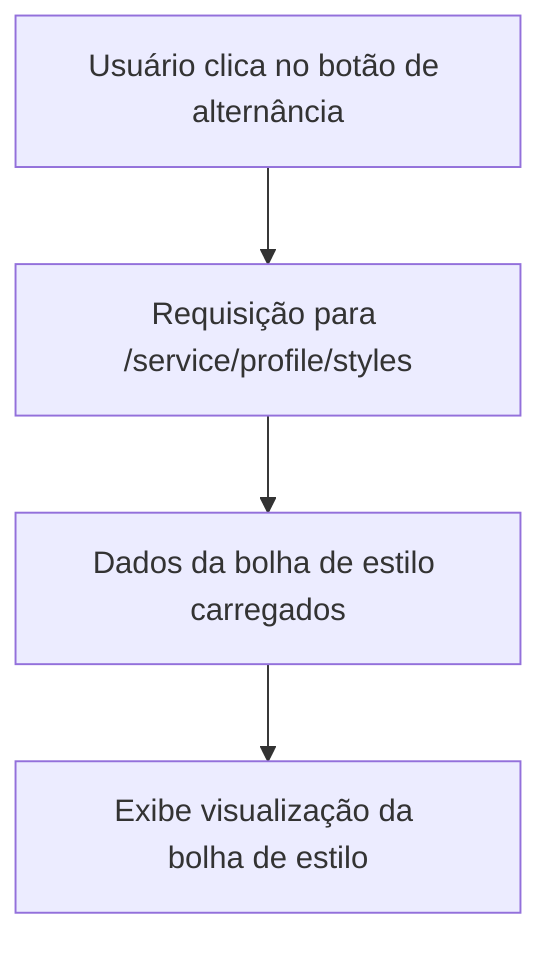

### Documentação da Tela de Perfil do Usuário com Bolha de Estilo

#### Descrição
A tela de perfil do usuário exibe informações do perfil, incluindo a foto do perfil, o nome do usuário e uma visualização chamada "Bolha de Estilo". Esta bolha é construída com base nas cores dos posts com os quais o usuário mais interagiu. A visualização da bolha de estilo é alternada por meio de um botão específico na tela de perfil. Todos os dados da bolha de estilo são carregados quando o usuário clica no botão para alternar para essa visualização.

#### Detalhes dos Componentes e Interações

##### Perfil do Usuário
1. **Dados do Perfil**
   - **Descrição:** Exibe a foto do perfil e o nome do usuário.
   - **Endpoint:** `/service/profile`
   - **Método:** `GET`
   - **Request Params:**
     ```json
     {
       "userId": "id_do_usuario"
     }
     ```
   - **Response Body:**
     ```json
     {
       "photoUrl": "url_da_foto_do_perfil",
       "name": "nome_do_usuario"
     }
     ```

##### Bolha de Estilo
1. **Bolha de Estilo**
   - **Descrição:** Exibe uma visualização gráfica baseada nas cores dos posts com os quais o usuário mais interagiu.
   - **Endpoint:** `/service/profile/styles`
   - **Método:** `GET`
   - **Request Params:**
     ```json
     {
       "userId": "id_do_usuario"
     }
     ```
   - **Response Body:**
     ```json
     {
       "styles": [
         {
           "styleId": "id_do_estilo",
           "color": "cor_dominante_do_estilo"
         }
       ]
     }
     ```

##### Botão de Alternância
1. **Botão de Alternância para Bolha de Estilo**
   - **Descrição:** Localizado acima do grid de publicações, este botão permite alternar a visualização para mostrar a "Bolha de Estilo".
   - **Funcionalidade:** Ao clicar no botão, uma requisição é enviada para carregar os dados da bolha de estilo, substituindo o grid de publicações pela visualização gráfica.

### Diagrama de Fluxo no Mermaid



#### Descrição do Fluxo
1. **Usuário clica no botão de alternância**: O usuário clica no botão localizado acima do grid de publicações para alternar para a visualização de "Bolha de Estilo".
2. **Requisição para `/service/profile/styles`**: Uma requisição é feita para carregar os dados da bolha de estilo com base nas interações do usuário.
3. **Dados da bolha de estilo carregados**: Os dados da bolha de estilo são carregados e exibidos na tela.
4. **Exibe visualização da bolha de estilo**: A visualização gráfica da bolha de estilo é exibida, substituindo o grid de publicações.

Este documento detalha todas as funcionalidades e endpoints associados à tela de perfil do usuário com a visualização de bolha de estilo, proporcionando uma visão completa das interações possíveis para desenvolvimento e testes.\