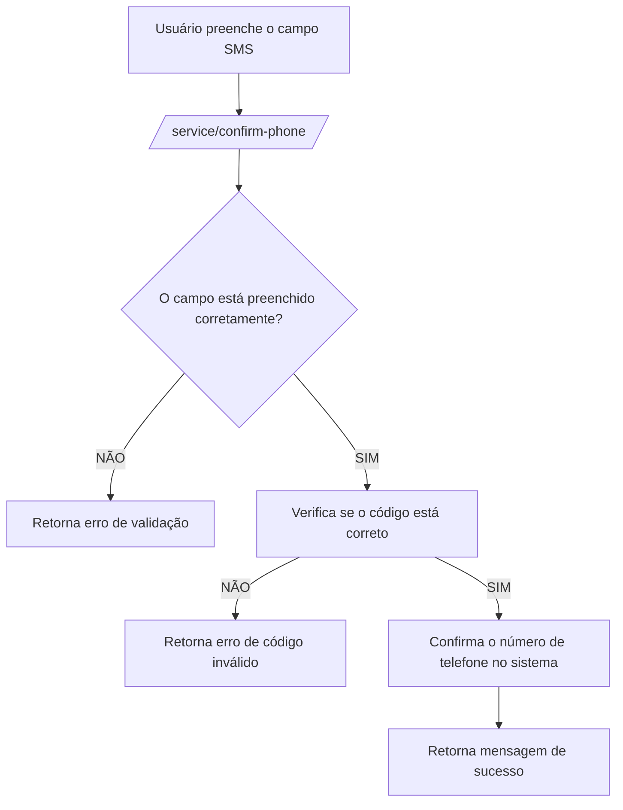

### Documentação da Rota de Confirmação de Celular

#### Descrição
A rota `/service/confirm-phone` é utilizada para confirmar o número de celular do usuário após o cadastro. O número de celular é fornecido na tela de cadastro. Esta rota envia um código SMS para o número de celular e verifica se o código inserido pelo usuário é válido.

#### Detalhes da Rota

```json
{
  "serviço": "phone-confirmation-service",
  "endpoint": "/service/confirm-phone",
  "metodo": "POST",
  "request-body": {
    "smsCode": "código_de_sms"
  },
  "request-header": [
    {
      "name": "Content-Type",
      "value": "application/json"
    }
  ],
  "response-code": 200,
  "response-body": {
    "message": "Número de telefone confirmado com sucesso"
  }
}
```

### Diagrama de Fluxo no Mermaid



#### Descrição do Fluxo
1. **Usuário preenche o campo SMS**: O usuário insere o código SMS recebido no celular.
2. **Enviar requisição para `/service/confirm-phone/`**: Os dados são enviados para o endpoint de confirmação de celular.
3. **Verificação de preenchimento do campo**: O serviço verifica se o campo de código SMS foi preenchido corretamente.
    - **Não preenchido corretamente**: Retorna um erro de validação.
    - **Preenchido corretamente**: Verifica se o código SMS inserido está correto.
4. **Verificação de código SMS**: O serviço verifica se o código fornecido pelo usuário está correto.
    - **Código inválido**: Retorna um erro indicando que o código SMS está incorreto.
    - **Código válido**: Confirma o número de telefone no sistema.
5. **Confirmação do número de telefone**: O serviço confirma o número de telefone no sistema.
6. **Resposta de sucesso**: O serviço retorna uma mensagem de sucesso indicando que o número de telefone foi confirmado.

Este documento descreve a funcionalidade e os detalhes técnicos da tela de confirmação de celular, incluindo o endpoint utilizado, a estrutura da requisição e resposta, e o fluxo de processo para confirmar o número de telefone do usuário.