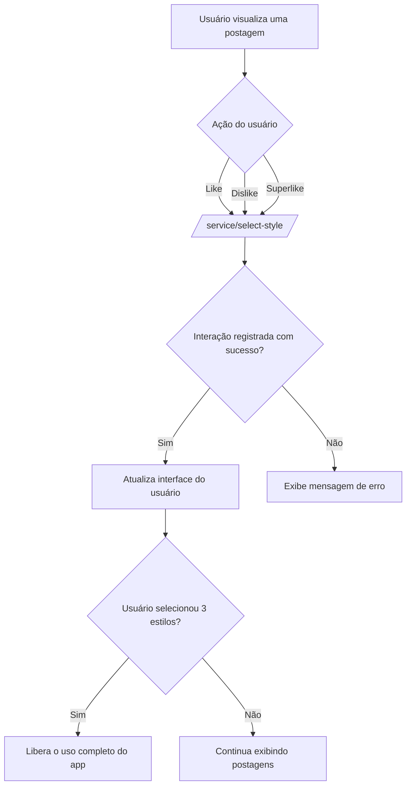

### Documentação da Tela de Seleção de Estilo

#### Descrição
Após o cadastro e confirmação do número de celular, esta tela é apresentada para que o usuário selecione seus estilos preferidos. A tela mostra uma sequência de postagens populares. O usuário pode interagir com cada postagem utilizando as opções de "like", "dislike" e "superlike" (limitado a um único uso). Após o usuário ter mostrado pelo menos 3 estilos que gosta (com "like" ou "superlike"), ele pode continuar a usar o aplicativo.

#### Detalhes da Rota de Seleção de Estilo

##### Endpoint: `/service/select-style`
- **Método:** `POST`
- **Descrição:** Endpoint utilizado para registrar as interações do usuário com as postagens (like, dislike, superlike).

##### Request Body
```json
{
  "userId": "id_do_usuario",
  "postId": "id_da_postagem",
  "action": "like|dislike|superlike"
}
```

##### Request Header
```json
[
  {
    "name": "Content-Type",
    "value": "application/json"
  }
]
```

##### Response Codes
- **200 OK:** Interação registrada com sucesso.
- **400 Bad Request:** Erro de validação dos dados fornecidos.
- **401 Unauthorized:** Usuário não autorizado.
- **429 Too Many Requests:** Limite de superlikes excedido.

##### Response Body
```json
{
  "message": "Interação registrada com sucesso",
  "remainingSuperLikes": 0 // Número de superlikes restantes
}
```

### Diagrama de Fluxo no Mermaid



#### Descrição do Fluxo
1. **Usuário visualiza uma postagem**: A postagem popular é apresentada na tela.
2. **Ação do usuário**: O usuário interage com a postagem utilizando uma das três opções: "like", "dislike" ou "superlike".
3. **Envio da requisição para `/service/select-style/`**: A ação do usuário é enviada para o backend para registro.
4. **Interação registrada com sucesso?**: O backend verifica se a interação foi registrada com sucesso.
    - **Sim**: A interface do usuário é atualizada.
    - **Não**: Uma mensagem de erro é exibida.
5. **Usuário selecionou 3 estilos?**: O sistema verifica se o usuário já interagiu positivamente (like ou superlike) com pelo menos 3 postagens.
    - **Sim**: O uso completo do aplicativo é liberado para o usuário.
    - **Não**: Novas postagens continuam sendo exibidas até que o critério seja satisfeito.

Este documento descreve a funcionalidade e os detalhes técnicos da tela de seleção de estilo, incluindo o endpoint utilizado, a estrutura da requisição e resposta, e o fluxo de processo para que o usuário possa continuar utilizando o aplicativo após selecionar seus estilos preferidos.