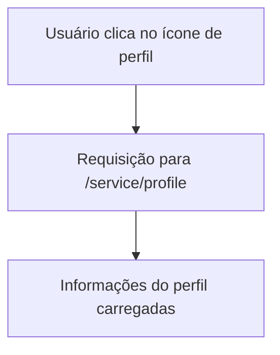

### Documentação da Tela de Perfil do Usuário com Publicações

#### Descrição
A tela de perfil do usuário exibe informações do perfil, incluindo a foto do perfil, o nome do usuário e um grid contendo todas as suas publicações. Todos os dados do perfil e publicações são carregados quando o usuário acessa a tela de perfil ao clicar no ícone de perfil no menu flutuante inferior.

#### Detalhes dos Componentes e Interações

##### Perfil do Usuário
1. **Dados do Perfil**
   - **Descrição:** Exibe a foto do perfil, nome do usuário e todas as suas publicações.
   - **Endpoint:** `/service/profile`
   - **Método:** `GET`
   - **Request Params:**
     ```json
     {
       "userId": "id_do_usuario"
     }
     ```
   - **Response Body:**
     ```json
     {
       "photoUrl": "url_da_foto_do_perfil",
       "name": "nome_do_usuario",
       "posts": [
         {
           "postId": "id_da_postagem",
           "title": "titulo_da_postagem",
           "content": "conteudo_da_postagem",
           "timestamp": "data_hora_postagem"
         }
       ]
     }
     ```

2. **Grid de Publicações**
   - **Descrição:** Exibe todas as publicações do usuário em um formato de grade.

3. **Botão de Alternância**
   - **Descrição:** Localizado acima do grid de publicações, este botão permite alternar para a visualização de "bolha de estilo", que exibe as categorias de estilos preferidos pelo usuário.

### Diagrama de Fluxo no Mermaid



#### Descrição do Fluxo
1. **Usuário clica no ícone de perfil**: O usuário acessa a tela de perfil clicando no ícone correspondente no menu flutuante inferior.
2. **Requisição para `/service/profile`**: Uma requisição é feita para carregar todas as informações do perfil do usuário, incluindo foto, nome e publicações.
3. **Informações do perfil carregadas**: As informações do perfil são exibidas na tela.

Este documento detalha todas as funcionalidades e endpoints associados à tela de perfil do usuário com publicações, proporcionando uma visão completa das interações possíveis para desenvolvimento e testes.