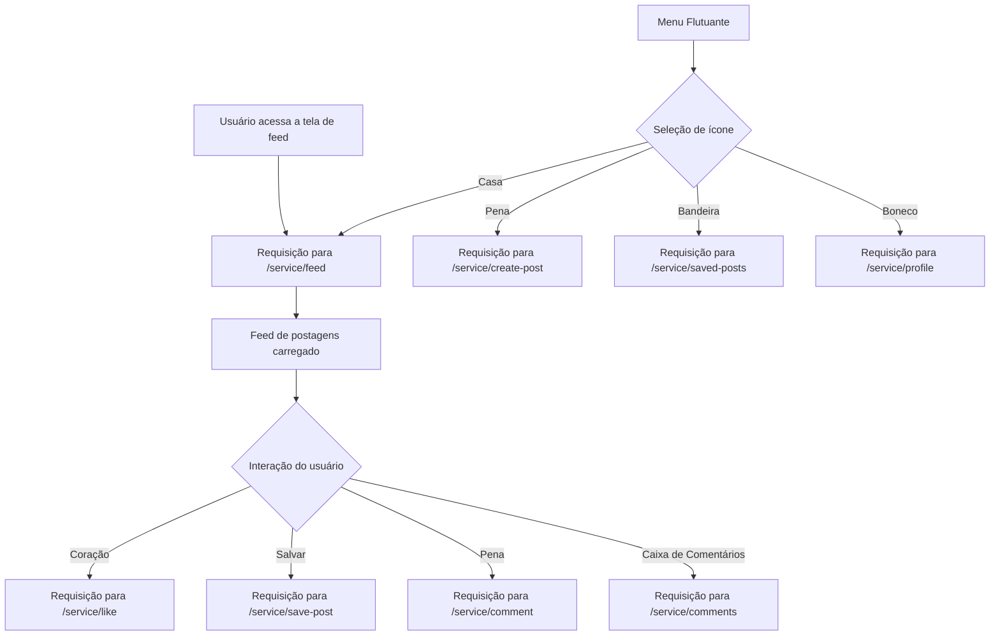

### Documentação da Tela de Feed de Postagens

#### Descrição
A tela de feed de postagens exibe uma lista de postagens populares e permite várias interações do usuário. Esta documentação cobre todos os comportamentos e interações possíveis nesta tela, incluindo os endpoints envolvidos.

#### Detalhes dos Componentes e Interações

##### Ícones no Topo da Tela
1. **Coração (Interações com seus posts)**
   - **Descrição:** Exibe todas as pessoas que interagiram com as postagens do usuário.
   - **Endpoint:** `/service/interactions`
   - **Método:** `GET`
   - **Response Body:**
     ```json
     [
       {
         "userId": "id_do_usuario",
         "postId": "id_da_postagem",
         "action": "like|comment|share",
         "timestamp": "data_hora_interacao"
       }
     ]
     ```

2. **Sino (Mensagens Recebidas)**
   - **Descrição:** Mostra quem enviou mensagens ao usuário.
   - **Endpoint:** `/service/messages`
   - **Método:** `GET`
   - **Response Body:**
     ```json
     [
       {
         "messageId": "id_da_mensagem",
         "senderId": "id_do_remetente",
         "content": "conteudo_da_mensagem",
         "timestamp": "data_hora_mensagem"
       }
     ]
     ```

##### Cards das Postagens
1. **Título do Post (header)**
   - **Descrição:** Exibe o título da postagem.

2. **Coração (Like na Postagem)**
   - **Descrição:** Permite ao usuário dar like na postagem.
   - **Endpoint:** `/service/like`
   - **Método:** `POST`
   - **Request Body:**
     ```json
     {
       "userId": "id_do_usuario",
       "postId": "id_da_postagem"
     }
     ```
   - **Response Body:**
     ```json
     {
       "message": "Postagem curtida com sucesso"
     }
     ```

3. **Botão de Salvar (Salvar Postagem)**
   - **Descrição:** Permite ao usuário salvar a postagem para visualização posterior.
   - **Endpoint:** `/service/save-post`
   - **Método:** `POST`
   - **Request Body:**
     ```json
     {
       "userId": "id_do_usuario",
       "postId": "id_da_postagem"
     }
     ```
   - **Response Body:**
     ```json
     {
       "message": "Postagem salva com sucesso"
     }
     ```

4. **Pena (Escrever Comentário)**
   - **Descrição:** Permite ao usuário escrever um comentário na postagem.
   - **Endpoint:** `/service/comment`
   - **Método:** `POST`
   - **Request Body:**
     ```json
     {
       "userId": "id_do_usuario",
       "postId": "id_da_postagem",
       "comment": "conteudo_do_comentario"
     }
     ```
   - **Response Body:**
     ```json
     {
       "message": "Comentário enviado com sucesso"
     }
     ```

5. **Caixa de Comentários (Ver Comentários)**
   - **Descrição:** Permite ao usuário visualizar os comentários de uma postagem.
   - **Endpoint:** `/service/comments`
   - **Método:** `GET`
   - **Request Params:**
     ```json
     {
       "postId": "id_da_postagem"
     }
     ```
   - **Response Body:**
     ```json
     [
       {
         "commentId": "id_do_comentario",
         "userId": "id_do_usuario",
         "content": "conteudo_do_comentario",
         "timestamp": "data_hora_comentario"
       }
     ]
     ```

##### Menu Flutuante Inferior
1. **Casa (Feed de Notícias)**
   - **Descrição:** Leva o usuário para a página principal contendo o feed de notícias.
   - **Endpoint:** `/service/feed`
   - **Método:** `GET`
   - **Response Body:**
     ```json
     [
       {
         "postId": "id_da_postagem",
         "title": "titulo_da_postagem",
         "content": "conteudo_da_postagem",
         "timestamp": "data_hora_postagem",
         "likes": "numero_de_likes",
         "comments": "numero_de_comentarios"
       }
     ]
     ```

2. **Marketplace (Feature futura)**
   - **Descrição:** Futuramente, permitirá o acesso ao marketplace.
   - **Endpoint:** N/A (Em desenvolvimento)

3. **Pena (Criar Novo Post)**
   - **Descrição:** Permite ao usuário criar uma nova postagem.
   - **Endpoint:** `/service/create-post`
   - **Método:** `POST`
   - **Request Body:**
     ```json
     {
       "userId": "id_do_usuario",
       "title": "titulo_da_postagem",
       "content": "conteudo_da_postagem"
     }
     ```
   - **Response Body:**
     ```json
     {
       "message": "Postagem criada com sucesso"
     }
     ```

4. **Bandeira (Ver Postagens Salvas)**
   - **Descrição:** Permite ao usuário ver suas postagens salvas.
   - **Endpoint:** `/service/saved-posts`
   - **Método:** `GET`
   - **Request Params:**
     ```json
     {
       "userId": "id_do_usuario"
     }
     ```
   - **Response Body:**
     ```json
     [
       {
         "postId": "id_da_postagem",
         "title": "titulo_da_postagem",
         "content": "conteudo_da_postagem",
         "timestamp": "data_hora_postagem"
       }
     ]
     ```

5. **Boneco (Perfil do Usuário)**
   - **Descrição:** Leva o usuário para a página de perfil.
   - **Endpoint:** `/service/profile`
   - **Método:** `GET`
   - **Request Params:**
     ```json
     {
       "userId": "id_do_usuario"
     }
     ```
   - **Response Body:**
     ```json
     {
       "userId": "id_do_usuario",
       "name": "nome_do_usuario",
       "email": "email_do_usuario",
       "phone": "telefone_do_usuario",
       "posts": [
         {
           "postId": "id_da_postagem",
           "title": "titulo_da_postagem",
           "content": "conteudo_da_postagem",
           "timestamp": "data_hora_postagem"
         }
       ]
     }
     ```

### Diagrama de Fluxo no Mermaid



#### Descrição do Fluxo
1. **Usuário acessa a tela de feed**: O usuário acessa a tela principal contendo o feed de postagens.
2. **Requisição para `/service/feed`**: Uma requisição é feita para carregar o feed de postagens.
3. **Feed de postagens carregado**: As postagens são exibidas na tela.
4. **Interação do usuário**: O usuário pode interagir com as postagens usando os ícones de coração, salvar, pena e caixa de comentários.
    - **Coração (like)**: Envia uma requisição para curtir a postagem.
    - **Salvar**: Envia uma requisição para salvar a postagem.
    - **Pena (comentar)**: Envia uma requisição para adicionar um comentário à postagem.
    - **Caixa de Comentários**: Envia uma requisição para visualizar os comentários da postagem.
5. **Menu Flutuante**: O usuário pode usar o menu flutuante para navegar entre diferentes seções do aplicativo.
    - **Casa**: Recarrega o feed de postagens.
    - **Pena**: Permite criar uma nova postagem.
    - **Bandeira**: Exibe as postagens salvas.
    - **Boneco**: Leva o usuário para a página de perfil.

Este documento detalha todas as funcionalidades e endpoints associados à tela de feed de postagens, proporcionando uma visão completa das interações possíveis para desenvolvimento e testes.