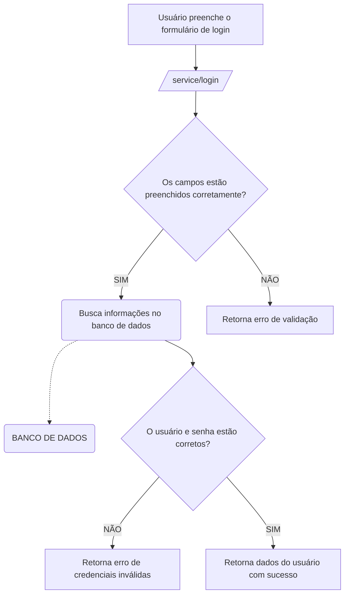

### Documentação da Rota de Login

#### Descrição
A rota `/service/login` é utilizada para autenticar usuários no sistema. O endpoint recebe as credenciais de login (usuário e senha), verifica a validade dessas credenciais e retorna os dados do usuário se forem válidas.

#### Detalhes da Rota

```json
{
  "serviço": "login-manager-service",
  "endpoint": "/service/login",
  "metodo": "POST",
  "request-body": {
    "user": "exemplo@gmail.com",
    "password": "senha_do_usuario"
  },
  "request-header":[
    {
      "name": "Content-Type",
      "value": "application/json"
    }
  ],
  "response-code": 200,
  "response-body": {
    "name": "Nome do Usuário",
    "id": "id_do_usuario"
  }
}
```

### Diagrama de Fluxo no Mermaid



#### Descrição do Fluxo
1. **Usuário preenche o formulário de login**: O usuário insere seu email e senha.
2. **Enviar requisição para `/service/login/`**: Os dados são enviados para o endpoint de login.
3. **Verificação de preenchimento dos campos**: O serviço verifica se todos os campos foram preenchidos corretamente.
    - **Não preenchido corretamente**: Retorna um erro de validação.
    - **Preenchido corretamente**: Verifica se o usuário e senha estão corretos.
4. **Verificação de credenciais**: O serviço verifica se as credenciais fornecidas estão corretas.
    - **Credenciais inválidas**: Retorna um erro indicando que as credenciais estão incorretas.
    - **Credenciais válidas**: Busca os dados do usuário no banco de dados.
5. **Busca dos dados do usuário**: O serviço recupera os dados do usuário no banco de dados.
6. **Resposta de sucesso**: O serviço retorna uma mensagem de sucesso juntamente com o nome e ID do usuário.

Essa documentação cobre a rota de login, detalhando o endpoint, método, corpo da requisição, cabeçalhos, código de resposta, corpo da resposta, e inclui um diagrama de fluxo para visualizar o processo de autenticação.