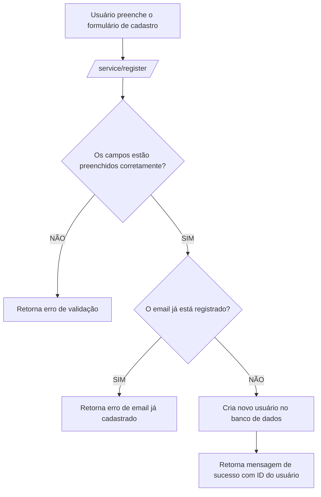

### Documentação da Rota de Cadastro

#### Descrição
A rota `/service/register` é utilizada para registrar novos usuários no sistema. O endpoint recebe os dados de cadastro, verifica sua validade e cria uma nova entrada de usuário no banco de dados se todas as condições forem atendidas.

#### Detalhes da Rota

```json
{
  "serviço": "user-registration-service",
  "endpoint": "/service/register",
  "metodo": "POST",
  "request-body": {
      "email": "exemplo@gmail.com",
      "password": "senha_do_usuario",
      "confirmPassword": "confirmar_senha",
      "phone": "(**) ****-****"
  },
  "request-header":[
    {
      "name": "Content-Type",
      "value": "application/json"
    }
  ],
  "response-code": 200,
  "response-body": {
    "message": "Usuário registrado com sucesso",
    "userID": "id_do_usuario_criado"
  }
}
```

### Diagrama de Fluxo no Mermaid



#### Descrição do Fluxo
1. **Usuário preenche o formulário de cadastro**: O usuário insere seu email, senha, confirmação de senha e telefone.
2. **Enviar requisição para `/service/register/`**: Os dados são enviados para o endpoint de registro.
3. **Verificação de preenchimento dos campos**: O serviço verifica se todos os campos foram preenchidos corretamente.
    - **Não preenchido corretamente**: Retorna um erro de validação.
    - **Preenchido corretamente**: Verifica se o email já está registrado.
4. **Verificação de email registrado**: O serviço verifica se o email já está registrado no sistema.
    - **Email já registrado**: Retorna um erro indicando que o email já está em uso.
    - **Email não registrado**: Cria um novo usuário no banco de dados.
5. **Criação do usuário**: Um novo usuário é criado no banco de dados com os dados fornecidos.
6. **Resposta de sucesso**: O serviço retorna uma mensagem de sucesso juntamente com o ID do novo usuário criado.