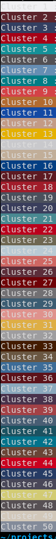

# Entregável 2

## Conjunto de dados
Usamos um conjunto de dados de https://github.com/yumingj/DeepFashion-MultiModal. Ele contém 44.096 fotos de modelagem, muitas das quais duplicadas de diferentes ângulos. Precisamos apenas de fotos onde vemos o modelo como um todo (superior e inferior), por isso filtramos o conjunto de dados para manter apenas as fotos utilizáveis. Como as imagens são relativamente grandes (em torno de 1000x1000), redimensionamos as imagens para agilizar o tempo de processamento posterior.
O conjunto de dados filtrado e redimensionado está disponível [aqui](https://drive.google.com/drive/folders/1_du47YFJGXp0veHWjdE59SLThpPCwxqg?usp=drive_link).

Filtre o script com base nos nomes dos arquivos:
```python
import glob
import os

images_path = "images/original"
trash_path = "images/trash"

original_files = glob.glob(images_path + "/*.jpg")

# for each image id, if there is a full type, keep only the full type
# otherwise, keep front and additional types because they can be fullbodies
for file in original_files:
    filename = file.split("/")[-1]
    similars = glob.glob(images_path + "/*" + filename.split("_")[2]+"*")
    if len(similars) >= 2:
        has_full = any("_full" in sim for sim in similars)
        if has_full:
            for similar in similars:
                if "_full" in similar:
                    continue
                else:
                    os.replace(similar, trash_path + "/" + similar.split("/")[-1])
        else:
            for similar in similars:
                if "_front" in similar or "_additional" in similar:
                    continue
                else:
                    os.replace(similar, trash_path + "/" + similar.split("/")[-1]) 
```

Script de redimensionnement des images :
```python
import cv2
import glob

images_path = "images/original"
resized_path = "images/resized"

original_files = glob.glob(images_path + "/*")

# resize images by 50%
for file in original_files:
    img = cv2.imread(file)
    img_50 = cv2.resize(img, None, fx = 0.50, fy = 0.50)
    cv2.imwrite(resized_path + "/" + file.split("/")[-1], img_50)
```
Este conjunto de dados ainda apresenta vários vieses:
- Após a filtragem, temos 1.626 imagens de homens e 12.569 imagens de mulheres.
- As imagens vêm de uma fonte ocidental, portanto nem todas as populações e estilos estão representados.
- As imagens são de qualidade profissional com luz que permite ver as cores com clareza. Este não será necessariamente o caso das fotos tiradas pelos usuários, portanto o conjunto de dados não representa perfeitamente a realidade do nosso caso de uso.
## Processamento de imagem

O primeiro processamento consistiu em extrair as cores das roupas usadas pelas modelos do nosso conjunto de dados, bem como o seu tom de pele.
Para fazer isso, usamos o [modelo de segmentação pré-treinado](https://huggingface.co/mattmdjaga/segformer_b2_clothes). Existem 17 categorias de segmentação diferentes. Para os homens, estamos interessados ​​em 3 categorias: top, bottom e skin. Para as mulheres, estamos interessados ​​em 5 categorias: top, bottom, skin, saia e vestido (que pode ser considerado uma combinação de top e bottom). Não levamos em consideração imagens para as quais uma das categorias não esteja presente.

Para cada segmento, obtivemos uma máscara binária. Aplicamos esta máscara à imagem original para obter uma imagem apenas com o segmento que nos interessa e depois extraímos as cores dominantes de cada segmento. Houve dificuldade com a cor de fundo que poderia ser confundida com a cor dominante do segmento (cor preta). Para evitar isso, transformamos as imagens em RGBA e definimos o valor de opacidade do fundo como 0. Isto permite determinar a cor dominante de cada segmento sem levar em conta o fundo. Em seguida, usamos a biblioteca [extcolors](https://pypi.org/project/extcolors/) para extrair as cores dominantes de cada segmento.
## Conjunto

Uma vez extraídas as cores e armazenadas no formato RGB, utilizamos a biblioteca Scikit-Learn para testar suas funcionalidades de clustering. O objetivo era criar grupos de cores semelhantes a partir do conjunto de dados construído. Os clusters criados não eram satisfatórios, as cores associadas eram muito semelhantes.

É por isso que avançamos para um espaço de cores mais representativo da percepção do olho humano: o LAB. As cores associadas aos clusters diferem conforme desejado.




## Aplicativo

Agora que nosso processo de agrupamento de cores está pronto, podemos aplicá-lo aos nossos dados. Criaremos agrupamentos de tons de pele (da ordem de 3 a 5 grupos), para depois criarmos agrupamentos de cores de roupas para cada grupo de tons de pele. Poderemos assim criar grupos de roupas que combinem bem para cada grupo de tons de pele.

Por fim, podemos criar um aplicativo que permitirá ao usuário escolher o seu tom de pele e ver as roupas que combinam com ele. Também podemos oferecer-lhe fotos de modelos que tenham o mesmo tom de pele que ele para que ele se projete.